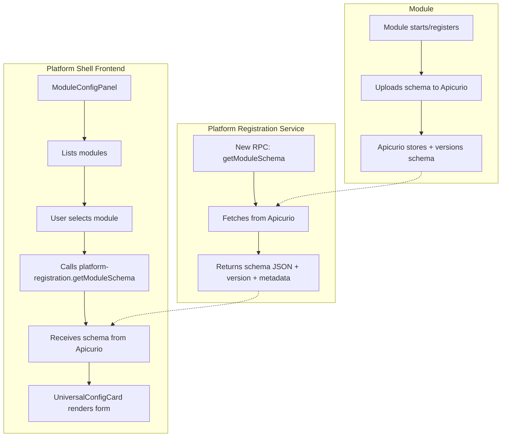
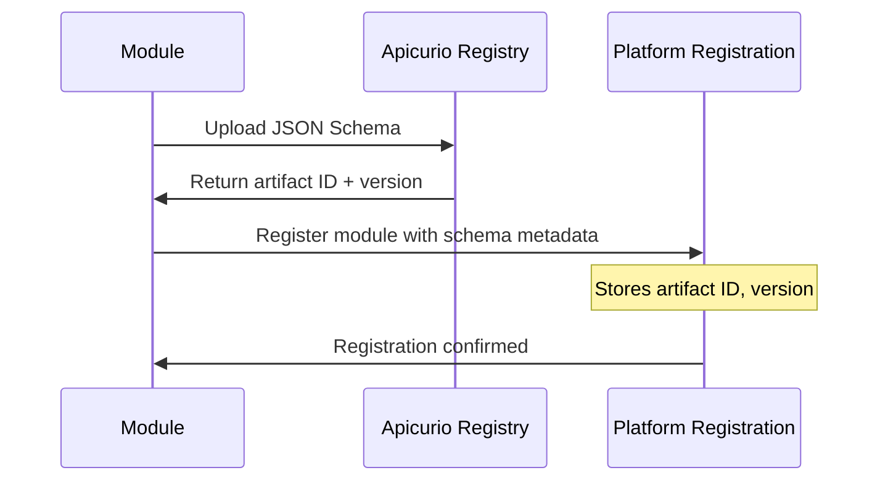
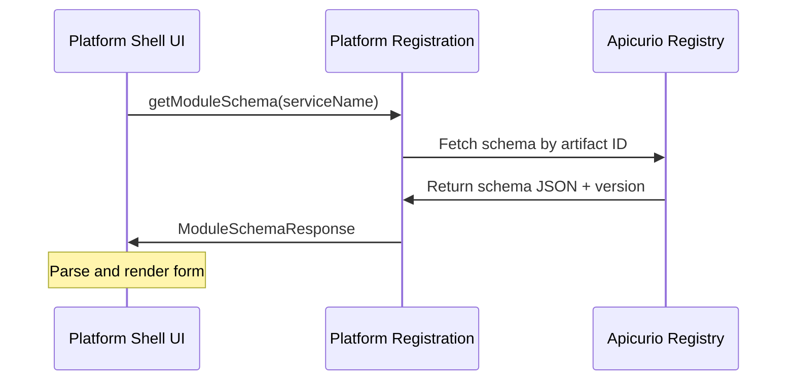

# Module UI Rendering Architecture

## 1. Overview and Philosophy

When developing a module for the pipeline, developers should spend most of their time on the processing logic and have the ability to easily configure it without writing custom UI code.

The Platform provides a solution through **schema-driven UI generation**. Using standardized JSON Schema definitions, the platform can automatically generate a professional, interactive configuration form for any module using the `@jsonforms` library.

A core design principle is to allow developers to create processing modules in any gRPC-supported language without requiring them to write any frontend code.

## 2. Developer Workflow

1. **Create a module** in any language that supports gRPC
2. **Define a JSON Schema** that describes the configuration parameters for the module
3. **Upload schema to Apicurio** during module registration (schemas are already stored centrally)
4. **Register the module** with platform-registration-service
5. **Configure the module** in the Platform Shell UI, which fetches the schema from Apicurio via platform-registration-service and displays a professional form

## 3. Current Implementation (Transitional)

### How It Works Now

```mermaid
graph TD
    subgraph Module
        A[Module implements PipeStepProcessor service] --> B[getServiceRegistration RPC]
        B --> C[Returns ServiceRegistrationMetadata]
        C --> D[Contains json_config_schema field]
    end

    subgraph "Platform Shell Frontend"
        E[ModuleConfigPanel component] --> F[Lists modules via platform-registration]
        F --> G[User selects module]
        G --> H[Calls getServiceRegistration on module]
        H --> I[Receives JSON Schema as string]
        I --> J[UniversalConfigCard component]
        J --> K[@jsonforms/vue-vanilla or @jsonforms/vue-vuetify]
        K --> L[Rendered Vuetify Form]
    end

    D -.-> I
```

### Current Limitations

The current approach has modules return their schema directly via `getServiceRegistration()`:
- Frontend must call each module individually
- No centralized schema versioning
- No schema caching
- Module must be running to get its schema

## 4. New Implementation (In Progress)

### Architecture with Apicurio Integration



### Key Changes

**Backend (platform-registration-service):**
- **New RPC Method**: `getModuleSchema(String serviceName)`
- **Returns**: Schema JSON, version, and metadata from Apicurio
- **Benefit**: Single source of truth, centralized access

**Frontend:**
- Call `platform-registration.getModuleSchema(moduleName)` instead of module's `getServiceRegistration()`
- No need to create dynamic transports to individual modules
- Simpler, faster, more reliable

### Proposed gRPC Definition

```protobuf
service PlatformRegistration {
  // Existing methods...
  rpc ListModules(google.protobuf.Empty) returns (ModuleListResponse);

  // NEW: Centralized schema retrieval
  rpc GetModuleSchema(GetModuleSchemaRequest) returns (ModuleSchemaResponse);
}

message GetModuleSchemaRequest {
  string service_name = 1;
  optional string version = 2;  // If omitted, returns latest
}

message ModuleSchemaResponse {
  string service_name = 1;
  string schema_json = 2;           // JSON Schema as string
  string schema_version = 3;        // Version from Apicurio
  string artifact_id = 4;           // Apicurio artifact ID
  map<string, string> metadata = 5; // Additional metadata (author, description, etc.)
  google.protobuf.Timestamp updated_at = 6;
}
```

### Implementation Benefits

1. ✅ **Schemas already in Apicurio** - Backend integration exists
2. ✅ **Simpler frontend** - One service to call (platform-registration)
3. ✅ **Versioning** - Apicurio handles schema versions automatically
4. ✅ **Availability** - Get schema even if module is down
5. ✅ **Performance** - Can cache schemas in platform-registration
6. ✅ **Governance** - Centralized schema management
7. ✅ **History** - Apicurio tracks all schema changes

### Frontend Code Changes

**Old approach** (calling module directly):

```typescript
// OLD: Call each module directly
const client = createPipeStepProcessorClient(selectedModule.value);
const reg = await client.getServiceRegistration({});
schema.value = JSON.parse(reg.jsonConfigSchema);
```

**New approach** (call platform-registration):

```typescript
// NEW: Call platform-registration-service
const client = createPlatformRegistrationClient();
const response = await client.getModuleSchema({
  serviceName: selectedModule.value,
  // version: '1.2.0'  // Optional: specify version
});

schema.value = JSON.parse(response.schemaJson);
console.log('Schema version:', response.schemaVersion);
console.log('Apicurio artifact:', response.artifactId);
```

## 5. JSON Schema Format

**Example JSON Schema** (stored in Apicurio):

```json
{
  "type": "object",
  "title": "Chunker Configuration",
  "description": "Configuration for text chunking module",
  "properties": {
    "chunkSize": {
      "type": "integer",
      "title": "Chunk Size",
      "description": "Maximum size of each chunk in characters",
      "default": 500,
      "minimum": 100,
      "maximum": 2000
    },
    "overlap": {
      "type": "integer",
      "title": "Overlap",
      "description": "Number of characters to overlap between chunks",
      "default": 50,
      "minimum": 0,
      "maximum": 500
    },
    "preserveParagraphs": {
      "type": "boolean",
      "title": "Preserve Paragraphs",
      "description": "Attempt to keep paragraphs intact",
      "default": true
    }
  },
  "required": ["chunkSize"],
  "examples": [
    "This is sample text to demonstrate chunking...",
    "Another example text..."
  ]
}
```

**Schema Best Practices:**

- Use `title` and `description` for field labels and help text
- Set `default` values for better UX
- Use `minimum`, `maximum`, `pattern` for validation
- Add `examples` array with sample text inputs (strings only)
- Use `x-hidden: true` to hide internal fields from the UI
- Support nested objects and arrays for complex configs

## 6. Frontend Components

### ModuleConfigPanel (Updated)

**Location**: `packages/shared-components/src/components/ModuleConfigPanel.vue`

**Responsibilities:**
- Lists available modules from platform-registration
- Allows user to select a module
- Calls **platform-registration.getModuleSchema(serviceName)**
- Parses the JSON schema string
- Passes schema to UniversalConfigCard

**Key update:**
```typescript
async function loadSchema() {
  if (!selectedModule.value) return;
  loadingSchema.value = true;
  error.value = '';

  try {
    const client = createPlatformRegistrationClient();
    // NEW: Get schema from platform-registration, not module
    const response = await client.getModuleSchema({
      serviceName: selectedModule.value
    });

    schema.value = JSON.parse(response.schemaJson);
    schemaVersion.value = response.schemaVersion;

    // Reset config to defaults
    config.value = {};
  } catch (e: any) {
    error.value = e?.message ?? String(e);
    schema.value = null;
  } finally {
    loadingSchema.value = false;
  }
}
```

### UniversalConfigCard

**Location**: Multiple implementations in pipeline modules and shared components

**Responsibilities:**
- Accepts JSON Schema as a prop
- Filters out hidden/readonly fields (`x-hidden`, `readOnly`)
- Renders form using JSONForms
- Provides fallback key-value editor if no schema
- Handles form submission and validation

**JSONForms Integration:**

```vue
<JsonForms
  :schema="filteredSchema"
  :data="formData"
  :renderers="renderers"
  @change="handleFormChange"
/>
```

**Libraries used:**
- `@jsonforms/vue` - Core Vue 3 integration
- `@jsonforms/vue-vanilla` - Vanilla HTML renderers
- `@jsonforms/vue-vuetify` - Vuetify-based renderers

## 7. Schema Lifecycle with Apicurio

### Module Registration Flow



### Schema Retrieval Flow



## 8. Migration Strategy

### Phase 1: Add getModuleSchema RPC (Current)
- ✅ Schemas already stored in Apicurio
- 🔨 Add `getModuleSchema()` RPC to platform-registration-service
- 🔨 Implement Apicurio fetch logic in platform-registration
- ⏳ Keep `getServiceRegistration()` working as fallback

### Phase 2: Update Frontend
- 🔜 Update ModuleConfigPanel to use `getModuleSchema()`
- 🔜 Add schema version display in UI
- 🔜 Optional: Add version selector dropdown
- ⏳ Keep old code path for backward compatibility

### Phase 3: Deprecate Direct Schema Calls
- 🔜 Remove calls to module's `getServiceRegistration()` for schema
- 🔜 Modules can still implement it for other purposes
- 🔜 All schema access goes through platform-registration

## 9. Advantages Over Previous Approach

| Aspect | Old (Module Direct) | New (Platform-Registration) |
|--------|-------------------|----------------------------|
| **Availability** | Module must be running | Schema available even if module down |
| **Performance** | Call each module | Single service, cacheable |
| **Versioning** | No version control | Apicurio versioning built-in |
| **Complexity** | Dynamic transports needed | Simple client call |
| **Governance** | Scattered | Centralized in Apicurio |
| **Metadata** | Limited | Rich metadata support |
| **History** | None | Full audit trail |
| **Frontend Calls** | N modules | 1 service |

## 10. Schema Filtering and Processing

The `UniversalConfigCard` component filters the raw schema to:

1. **Remove hidden fields**: `x-hidden: true` or `x-hidden: 'true'`
2. **Remove readonly fields**: `readOnly: true`
3. **Extract text examples**: Filters `examples` array for strings only
4. **Initialize defaults**: Sets default values based on schema `default` field or type
5. **Generate UI schema**: Auto-generates vertical layout for all visible properties

## 11. Related Components

### Frontend
- **ModulesPage.vue** - Main entry point (`/modules` route)
- **ModuleConfigPanel.vue** - Module selection and orchestration
- **UniversalConfigCard.vue** - Schema-driven form rendering
- **VuetifyConfigCard.vue** - Alternative Vuetify-based renderer

### Backend
- **platform-registration-service** - Lists modules, **provides schemas from Apicurio**
- **Apicurio Registry** - Stores and versions all module schemas
- **platform-shell proxy** - Routes gRPC calls

### Libraries
- `@jsonforms/vue` - Vue 3 integration
- `@jsonforms/vue-vanilla` - Vanilla renderers
- `@jsonforms/vue-vuetify` - Vuetify renderers
- `@ai-pipestream/shared-components` - Shared UI components

## 12. Developer Resources

**JSON Schema References:**
- [JSON Schema Specification](https://json-schema.org/)
- [JSONForms Documentation](https://jsonforms.io/)
- [JSONForms Vue Integration](https://jsonforms.io/docs/integrations/vue)

**Apicurio Registry:**
- [Apicurio Registry Getting Started](https://www.apicur.io/registry/getting-started/)
- [Apicurio Registry Documentation](https://www.apicur.io/registry/docs/apicurio-registry/3.1.x/getting-started/assembly-intro-to-the-registry.html)

**Example Modules:**
- Chunker: `apps/platform-shell/ui/src/pipeline-modules/chunker`
- Parser: `apps/platform-shell/ui/src/pipeline-modules/parser`
- Echo: `apps/platform-shell/ui/src/pipeline-modules/echo`
