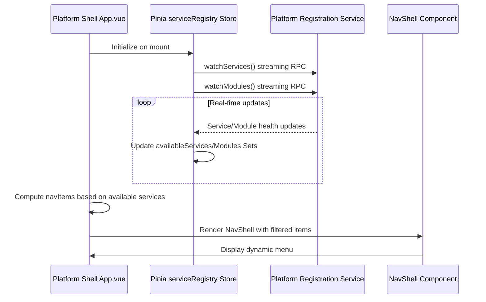
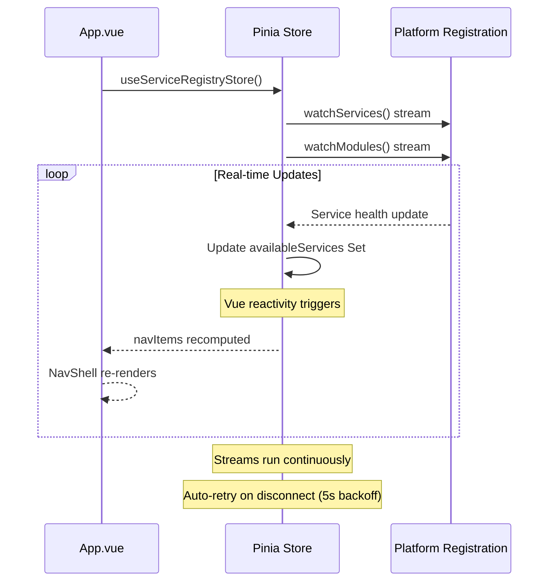

# Platform Shell Frontend Architecture

## 1. Overview

The Platform Shell is the central user interface for the entire AI Pipestream platform. It acts as the main dashboard and entry point, providing a consistent layout and user experience for all the different service frontends and pipeline modules.

Its most important feature is a **dynamic navigation menu** that automatically discovers and displays links to all available services and modules at runtime based on their health status.

## 2. Architecture and Data Flow

The system uses a combination of:
- **Pinia store** for reactive service/module registry
- **Vue Router** for routing to embedded service UIs
- **NavShell component** from `@ai-pipestream/shared-nav` for layout
- **Streaming gRPC** via platform-registration-service for real-time updates



## 3. Key Components

### 3.1. Platform Shell Application

**Location:** `apps/platform-shell/ui/src/App.vue`

**Structure:**
- Vue 3 SPA using Composition API with `<script setup>`
- Uses Vuetify 3 for Material Design components
- Router-based navigation with lazy-loaded views
- Graceful error handling with `SystemError` component

**Navigation Logic:**

```vue
<template>
  <SystemError v-if="systemError" />
  <NavShell
    v-else
    :title="'Pipeline Platform'"
    :items="navItems"
    :auto-load-menu="false"
    :periodic-refresh-ms="0"
  >
    <router-view />
  </NavShell>
</template>

<script setup lang="ts">
import { NavShell } from '@ai-pipestream/shared-nav';
import { useServiceRegistryStore } from './stores/serviceRegistry';

const serviceRegistry = useServiceRegistryStore();

// Platform items - always visible
const platformItems: NavItem[] = [
  { title: 'Home', icon: 'mdi-home', to: '/' },
  { title: 'Health', icon: 'mdi-heart-pulse', to: '/health' },
  { title: 'Modules', icon: 'mdi-puzzle', to: '/modules' },
  // ... more static items
];

// Service configuration - maps service names to routes
const serviceConfig = [
  { service: 'account-manager', path: '/accounts', title: 'Account Manager', icon: 'mdi-account-group' },
  { service: 'connector-service', path: '/admin-connector', title: 'Connectors', icon: 'mdi-power-plug' },
  { service: 'mapping-service', path: '/mapping', title: 'Mapping', icon: 'mdi-map' },
  // ... more services
];

// Module configuration - maps module names to routes
const pipelineModuleConfig = [
  { service: 'chunker', path: '/modules/chunker', title: 'Chunker', icon: 'mdi-scissors-cutting' },
  { service: 'echo', path: '/modules/echo', title: 'Echo', icon: 'mdi-message-reply-text' },
  // ... more modules
];

// Computed navigation - filters based on availability
const navItems = computed(() => {
  const items: NavItem[] = [...platformItems];

  // Add Services group if any are available
  const availableServiceItems = serviceConfig
    .filter(s => serviceRegistry.availableServices.has(s.service))
    .map(s => ({ title: s.title, icon: s.icon, to: s.path }));

  if (availableServiceItems.length > 0) {
    items.push({
      title: 'Services',
      icon: 'mdi-cube-outline',
      children: availableServiceItems
    });
  }

  // Add Pipeline Modules group if any are available
  const availablePipelineItems = pipelineModuleConfig
    .filter(m => serviceRegistry.availableModules.has(m.service))
    .map(m => ({ title: m.title, icon: m.icon, to: m.path }));

  if (availablePipelineItems.length > 0) {
    items.push({
      title: 'Pipeline Modules',
      icon: 'mdi-puzzle',
      children: availablePipelineItems
    });
  }

  return items;
});
</script>
```

### 3.2. Service Registry Store (Pinia)

**Location:** `apps/platform-shell/ui/src/stores/serviceRegistry.ts`

**Responsibilities:**
- Maintains real-time Sets of available services and modules
- Streams updates from platform-registration-service via gRPC
- Auto-retries on connection failure (5 second backoff)
- Handles cleanup when store is unmounted

**Implementation:**

```typescript
import { defineStore } from 'pinia';
import { ref } from 'vue';
import { createClient } from '@connectrpc/connect';
import { createConnectTransport } from '@connectrpc/connect-web';
import { PlatformRegistration } from '@ai-pipestream/grpc-stubs/dist/registration/platform_registration_pb';

export const useServiceRegistryStore = defineStore('serviceRegistry', () => {
  // Reactive state
  const availableServices = ref<Set<string>>(new Set());
  const availableModules = ref<Set<string>>(new Set());

  // Stream management
  let serviceAbortController: AbortController | null = null;
  let moduleAbortController: AbortController | null = null;

  // Watch services via streaming RPC
  const startServiceStream = async () => {
    serviceAbortController = new AbortController();

    const transport = createConnectTransport({
      baseUrl: window.location.origin,
      useBinaryFormat: true
    });

    const client = createClient(PlatformRegistration, transport);

    try {
      for await (const response of client.watchServices({}, {
        signal: serviceAbortController.signal
      })) {
        const services = new Set<string>();
        for (const details of response.services) {
          if (details.isHealthy) {
            services.add(details.serviceName);
          }
        }
        availableServices.value = services;
      }
    } catch (error) {
      // Retry on error (with backoff)
      setTimeout(startServiceStream, 5000);
    }
  };

  // Watch modules via streaming RPC
  const startModuleStream = async () => {
    moduleAbortController = new AbortController();

    const transport = createConnectTransport({
      baseUrl: window.location.origin,
      useBinaryFormat: true
    });

    const client = createClient(PlatformRegistration, transport);

    try {
      for await (const response of client.watchModules({}, {
        signal: moduleAbortController.signal
      })) {
        const modules = new Set<string>();
        for (const details of response.modules) {
          if (details.isHealthy) {
            modules.add(details.moduleName);
          }
        }
        availableModules.value = modules;
      }
    } catch (error) {
      // Retry on error (with backoff)
      setTimeout(startModuleStream, 5000);
    }
  };

  // Auto-initialize streams on store creation
  startServiceStream();
  startModuleStream();

  return {
    availableServices,
    availableModules
  };
});
```

### 3.3. NavShell Component

**Location:** `packages/shared-nav/src/components/NavShell.vue`

**Package:** `@ai-pipestream/shared-nav`

**Features:**
- Vuetify-based navigation drawer and app bar
- Supports both static and auto-loaded menu items
- Handles nested menu items (groups)
- Supports external links (with `href` and `external: true`)
- Disabled state for unavailable services
- Optional refresh button for auto-loaded menus

**Props:**
```typescript
interface NavShellProps {
  title?: string;              // App bar title
  items?: NavItem[];           // Navigation items (static or computed)
  rail?: boolean;              // Mini drawer mode
  permanent?: boolean;         // Always visible drawer
  expandOnHover?: boolean;     // Expand on hover in rail mode
  autoLoadMenu?: boolean;      // Fetch items via HTTP (not used in platform-shell)
  itemsUrl?: string;           // URL to fetch items from (not used in platform-shell)
  periodicRefreshMs?: number;  // Auto-refresh interval (not used in platform-shell)
}

interface NavItem {
  title: string;
  icon?: string;
  to?: string;                 // Vue Router path
  href?: string;               // External URL
  external?: boolean;          // Opens in new tab
  disabled?: boolean;          // Grayed out, not clickable
  children?: NavItem[];        // Nested items (creates collapsible group)
}
```

**Platform Shell Usage:**
- `autoLoadMenu: false` - Navigation computed in App.vue, not fetched
- `periodicRefreshMs: 0` - No periodic refresh (uses real-time streaming instead)
- `items: navItems` - Computed property that filters based on service availability

### 3.4. Alternative: HTTP Menu Endpoint (Available but Unused)

The platform-shell **backend** provides an HTTP endpoint for menu items, but the frontend doesn't use it:

**Endpoint:** `GET /connect/system-nav/menu-items.json`

**Implementation:** `apps/platform-shell/src/index.ts`

This endpoint:
- Calls `listServices()` and `listModules()` on platform-registration
- Maps service names to UI paths
- Checks which services are resolvable
- Returns formatted JSON menu items

**Why it's not used:** The frontend uses Pinia streaming instead for better real-time updates and reactivity.

**Future:** Could be used by external clients or as a fallback mechanism.

## 4. Service Discovery Flow

### Real-time Streaming Approach



### Navigation Update Trigger

When a service/module becomes available or unavailable:

1. Platform-registration-service sends update via stream
2. Pinia store updates `availableServices` or `availableModules` Set
3. Vue reactivity triggers `navItems` computed property
4. Filtered navigation items are recalculated
5. NavShell automatically re-renders with updated menu

**No polling, no HTTP requests, no manual refresh needed!**

## 5. Service Type Categorization

Services and modules are organized into navigation groups:

### Core Platform Pages (Always Visible)

- **Home** - Landing page and overview
- **Health** - System health dashboard
- **Modules** - Module configuration interface
- **Filesystem Connector** - File upload interface
- **Links** - External service links
- **Components** - Component gallery

### Services Group (Dynamic)

Shown only if at least one service is available:

- **Account Manager** (`account-manager`)
- **Connectors** (`connector-service`)
- **Mapping** (`mapping-service`)
- **OpenSearch Manager** (`opensearch-manager`)
- **Registration** (`platform-registration-service`)
- **Repository** (`repository-service`)

### Pipeline Modules Group (Dynamic)

Shown only if at least one module is available:

- **Chunker** (`chunker`)
- **Echo** (`echo`)
- **Embedder** (`embedder`)
- **Parser** (`parser`)

## 6. Routing Architecture

**Location:** `apps/platform-shell/ui/src/router/index.ts`

### Route Categories

**1. Platform Routes** - Core pages:
```typescript
const platformRoutes = [
  { path: '/', name: 'home', component: () => import('../views/HomePage.vue') },
  { path: '/health', name: 'health', component: () => import('../pages/HealthPage.vue') },
  { path: '/modules', name: 'modules-page', component: () => import('../pages/ModulesPage.vue') },
  // ... more platform routes
];
```

**2. Service Routes** - Embedded service UIs with child routes:
```typescript
const serviceRoutes = [
  {
    path: '/accounts',
    component: () => import('../services/account-manager/src/App.vue'),
    children: [
      { path: '', component: () => import('../services/account-manager/src/views/AccountListView.vue') },
      { path: 'create', component: () => import('../services/account-manager/src/views/AccountCreateView.vue') }
    ]
  },
  // ... more services
];
```

**3. Pipeline Module Routes** - Module UIs:
```typescript
const pipelineModuleRoutes = [
  { path: '/modules/chunker', component: () => import('../pipeline-modules/chunker/src/App.vue') },
  { path: '/modules/echo', component: () => import('../pipeline-modules/echo/src/App.vue') },
  // ... more modules
];
```

All routes use **lazy-loading** via `import()` for optimal performance.

## 7. Service/Module Registration

For a service or module to appear in the navigation:

### Backend Requirements

1. **Register with platform-registration-service** via gRPC
2. **Implement health checks** (gRPC Health service)
3. **Report healthy status** to appear in navigation

### Frontend Requirements

1. **Add to configuration array** in `App.vue`:
   - `serviceConfig` for services
   - `pipelineModuleConfig` for modules
2. **Add route** in `router/index.ts`
3. **Create UI components** in `services/{name}/` or `pipeline-modules/{name}/`

**Service name must match** between platform-registration and the config array.

### Example: Adding a New Service

**Step 1:** Add to App.vue configuration:
```typescript
const serviceConfig = [
  // ... existing services
  {
    service: 'my-new-service',       // Must match registration service name
    path: '/my-service',
    title: 'My Service',
    icon: 'mdi-rocket'
  },
];
```

**Step 2:** Add route:
```typescript
const serviceRoutes = [
  // ... existing routes
  {
    path: '/my-service',
    name: 'my-service',
    component: () => import('../services/my-new-service/src/App.vue')
  }
];
```

**Step 3:** Create UI:
```
apps/platform-shell/ui/src/services/my-new-service/
├── src/
│   ├── App.vue
│   ├── views/
│   └── services/
```

**Step 4:** Backend service registers with platform-registration and reports healthy.

**Result:** Navigation item appears automatically when service is healthy!

## 8. Embedded Service UIs

Platform Shell uses an **embedded architecture** where service UIs are integrated into the main application rather than running as separate apps.

### Structure

```
apps/platform-shell/ui/src/
├── services/                    # Embedded service UIs
│   ├── account-manager/
│   │   └── src/
│   │       ├── App.vue          # Service UI root
│   │       ├── views/           # Service pages
│   │       └── services/        # gRPC clients
│   ├── connector-service/
│   ├── mapping-service/
│   ├── opensearch-manager/
│   ├── platform-registration/
│   └── repo-service/
└── pipeline-modules/            # Embedded module UIs
    ├── chunker/
    ├── echo/
    ├── embedder/
    └── parser/
```

### Benefits

- **Shared dependencies**: All services use same Vue/Vuetify/Connect versions
- **Unified build**: Single build process for entire platform
- **Consistent UX**: Shared navigation and styling
- **Code sharing**: Services can import from shared packages
- **Simplified deployment**: One Docker image for entire frontend

### Trade-offs

- **Monolithic bundle**: All service UIs bundled together
- **Coupled releases**: Services update together with platform-shell
- **Build complexity**: Changes to any service rebuild entire platform

## 9. System Health and Error Handling

### Health Check on Mount

```typescript
onMounted(async () => {
  try {
    const response = await fetch('/api/system-status');
    const data = await response.json();

    // Show error page if registration service is unavailable
    if (data.registration?.status === 'unavailable') {
      systemError.value = true;
    }
  } catch (error) {
    // If we can't check status, show error page
    systemError.value = true;
  }
});
```

### SystemError Component

**Location:** `apps/platform-shell/ui/src/components/SystemError.vue`

Displays a beautiful error page when critical services are unavailable:
- Shows system diagnostics
- Provides retry capability
- Auto-reload option
- Works offline for development

## 10. Dependencies

### Core Libraries

- **Vue 3** - Progressive JavaScript framework
- **Vuetify 3** - Material Design component library
- **Vue Router** - Client-side routing
- **Pinia** - State management
- **@connectrpc/connect-web** - gRPC-web client
- **@ai-pipestream/grpc-stubs** - Generated TypeScript types

### Shared Packages (from monorepo)

- **@ai-pipestream/shared-nav** - NavShell component
- **@ai-pipestream/shared-components** - Reusable UI components
- **@ai-pipestream/protobuf-forms** - Form generation from protobuf
- **@ai-pipestream/connector-shared** - Connector utilities

## 11. Development

### Running in Development

```bash
# From monorepo root
./scripts/start-platform-shell.sh

# Or separately
./scripts/start-backend.sh      # Backend on :38106
./scripts/start-frontend.sh     # Frontend on :33000
```

**Access:**
- Frontend (hot-reload): http://localhost:33000
- Backend API: http://localhost:38106

**How it works:**
- Vite dev server proxies `/ai.pipestream.*` requests to backend
- `window.location.origin` resolves to `http://localhost:33000`
- Vite proxy forwards to `http://localhost:38106`

### Environment Configuration

Create `.env` in `apps/platform-shell/ui/`:

```bash
VITE_BACKEND_URL=http://localhost:38106
VITE_DEV_SERVER_PORT=33000
VITE_GRPC_USE_BINARY=true
VITE_GRPC_DEBUG=true
```

## 12. Production Deployment

### Build Process

```bash
# From monorepo root
pnpm build  # Builds all packages + backend + frontend

# Backend output: apps/platform-shell/dist/
# Frontend output: apps/platform-shell/public/
```

### Running in Production

```bash
cd apps/platform-shell
NODE_ENV=production pnpm start
```

**Access:** http://localhost:38106

**How it works:**
- Express server serves static files from `public/`
- Same server handles Connect-RPC requests
- Frontend uses `window.location.origin` (resolves to production URL)
- No proxy needed - direct connection

### Docker

```bash
# Build
docker build -f apps/platform-shell/Dockerfile -t platform-shell .

# Run
docker run -d --name platform-shell -p 38106:38106 \
  -e PLATFORM_REGISTRATION_HOST=platform-registration-service \
  -e PLATFORM_REGISTRATION_PORT=38101 \
  platform-shell
```

## 13. Key Design Decisions

### Navigation Pattern: Static Config + Dynamic Filtering

**Decision:** Use static configuration arrays with dynamic filtering based on service availability.

**Why not auto-discovery?**
- ✅ **Control**: Explicit control over menu order, icons, titles
- ✅ **Type safety**: Configuration checked at compile time
- ✅ **Performance**: No HTTP request for menu items
- ✅ **Flexibility**: Can customize per service (icons, paths, grouping)

**Why not HTTP menu endpoint?**
- ✅ **Real-time**: Streaming updates are instant (no polling)
- ✅ **Reactivity**: Vue reactivity handles updates automatically
- ✅ **Simplicity**: No separate HTTP call, no caching issues

### Streaming vs Polling

**Decision:** Use gRPC streaming for service/module discovery.

**Benefits:**
- Real-time updates (sub-second latency)
- No polling overhead
- Server-push architecture
- Efficient (single connection, multiplexed)

### Embedded vs Separate Frontends

**Decision:** Embed service UIs within platform-shell application.

**Benefits:**
- Unified deployment (single Docker image)
- Shared dependencies (smaller total size)
- Consistent UX across all services
- Code sharing (components, utilities)

## 14. Navigation Menu Structure

### Current Menu Layout

```
Pipeline Platform
├── Home
├── Health
├── Modules
├── Filesystem Connector
├── Links
├── Components
├── Services (group - shown if any available)
│   ├── Account Manager
│   ├── Connectors
│   ├── Mapping
│   ├── OpenSearch Manager
│   ├── Registration
│   └── Repository
└── Pipeline Modules (group - shown if any available)
    ├── Chunker
    ├── Echo
    ├── Embedder
    └── Parser
```

### Dynamic Behavior

- **Empty groups hidden**: If no services are available, "Services" group is not shown
- **Individual items**: Only healthy services appear in menu
- **Real-time updates**: Menu updates automatically as services start/stop
- **Visual feedback**: Disabled state for services that are registered but not healthy

## 15. Related Documentation

- **Platform_Shell_Backend.md** - Backend proxy and routing architecture
- **Module_UI_Rendering.md** - How module configuration forms are generated
- **GRPC_Client_Examples.md** - Patterns for making gRPC calls
- **Service_Discovery_and_Health.md** - Service registration and health checks
