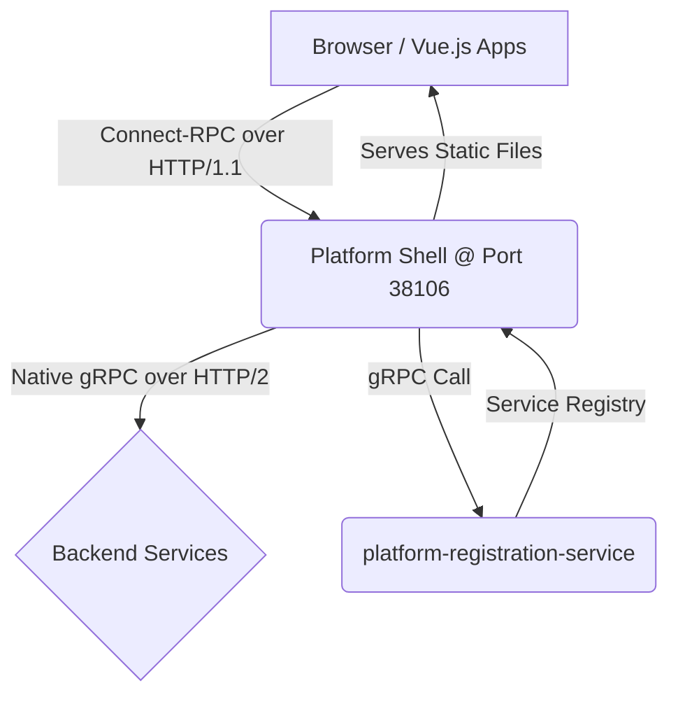

# Platform Shell Backend Architecture

## 1. Purpose and Role

The **platform-shell backend** (located at `apps/platform-shell/src/`) is a critical component that bridges the gap between browser-based frontends and backend gRPC services. Since browsers cannot make native HTTP/2 connections required for gRPC, the platform-shell serves as an intelligent gateway that provides several key capabilities:

- **Protocol Translation**: Converts browser-friendly Connect-RPC (gRPC-web over HTTP/1.1) to native gRPC (HTTP/2) for backend services
- **Dynamic Service Discovery**: Automatically finds the network location of healthy service instances by querying platform-registration-service
- **Centralized API Gateway**: Provides a single, stable endpoint (`http://localhost:38106` by default) for all frontend applications to consume backend services
- **Service Aggregation**: Combines data from multiple services, such as the `ShellService` which provides a unified health stream for the UI
- **Static File Serving**: Serves the built Vue.js frontend application from the `public/` directory

This is accomplished using the modern [Connect-RPC](https://connectrpc.com/) library suite from Buf (`@connectrpc/connect`, `@connectrpc/connect-express`, `@connectrpc/connect-node`). This allows the frontend to make type-safe function calls to the backend. Under the hood, these calls are transported over standard HTTP/1.1, but unlike traditional REST APIs that use verbose JSON, Connect uses the efficient Protobuf binary format for payloads, resulting in smaller and faster communication.

## 2. Architecture Overview



Frontend applications make Connect-RPC calls to the platform-shell, which routes them to the appropriate backend services without the frontend needing to know where they are or how to talk to them. This happens by "watching" the platform-registration-service for which services are discoverable and then routing requests appropriately.

## 3. Key Features & Implementation

### 3.1. Live Service Discovery

The platform-shell uses a real-time, streaming approach for service discovery, ensuring it always has an up-to-date list of healthy backend services. It does **not** use a polling or time-based cache mechanism.

**Implementation:** On startup, `serviceResolver.ts` establishes a persistent gRPC streaming connection to platform-registration-service by calling the `WatchServices` RPC. The resolver then listens for updates. Whenever a service is registered, unregistered, or changes its health status, the registration service sends a complete, new list of all healthy services. This list populates an in-memory map, which acts as a live service registry.

**Resolution:** When a request for a service comes in, the resolver performs a simple, synchronous lookup against this in-memory map. This is highly efficient and avoids any network latency for resolution.

```typescript
// Simplified from src/lib/serviceResolver.ts

// This map holds the live state of all healthy, registered services.
const serviceRegistry = new Map<string, ServiceDetails>();

// Create persistent transport to platform-registration-service
const REGISTRATION_URL = `http://${process.env.PLATFORM_REGISTRATION_HOST || 'localhost'}:${process.env.PLATFORM_REGISTRATION_PORT || '38101'}`;
const registrationTransport = createGrpcTransport({
  baseUrl: REGISTRATION_URL,
  idleConnectionTimeoutMs: 1000 * 60 * 60, // 1 hour for persistent connections
});

const registrationClient = createClient(PlatformRegistration, registrationTransport);

/**
 * Watches platform-registration-service for real-time updates.
 * This function runs continuously in the background.
 */
async function watchAndCacheServices() {
  try {
    const stream = registrationClient.watchServices({});
    for await (const response of stream) {
      // Atomically update the in-memory registry with the new list
      const newRegistry = new Map<string, ServiceDetails>();
      for (const service of response.services) {
        newRegistry.set(service.serviceName, service);
      }
      serviceRegistry.clear();
      for (const [key, value] of newRegistry.entries()) {
        serviceRegistry.set(key, value);
      }
    }
  } catch (error) {
    console.error("[ServiceResolver] Watch stream failed:", error);
    setTimeout(watchAndCacheServices, 5000); // Retry connection on failure
  }
}

/**
 * Resolves a service name from the live registry (synchronous lookup).
 */
export function resolveService(serviceName: string): { host: string; port: number } {
  const serviceDetails = serviceRegistry.get(serviceName);
  if (!serviceDetails) {
    throw new Error(`Service "${serviceName}" not found in live registry.`);
  }

  // Normalize localhost variants to IPv4 loopback
  const normalizedHost = serviceDetails.host === "localhost" ? "127.0.0.1" : serviceDetails.host;
  return { host: normalizedHost, port: serviceDetails.port };
}

/**
 * Creates a gRPC transport for a dynamically resolved service.
 */
export function createDynamicTransport(serviceName: string) {
  const { host, port } = resolveService(serviceName);
  return createGrpcTransport({
    baseUrl: `http://${host}:${port}`,
    idleConnectionTimeoutMs: 1000 * 60 * 60
  });
}

// Start watching for service updates in the background
watchAndCacheServices();
```

### 3.2. Service Routing Patterns

The platform-shell uses `@connectrpc/connect-express` to define Connect-RPC routes for each gRPC service in `src/routes/connectRoutes.ts`.

**Client Allocation Pattern:** Clients are created **on-demand for each request** rather than as singletons. This pattern:
- Allows dynamic transport resolution per request
- Supports `x-target-backend` header for runtime service selection
- Avoids stale connections to services that may restart
- Simplifies error handling and retry logic
- Keeps each request stateless and independent

#### Pattern 1: Fixed Service Name

Used when the backend service is always known:

```typescript
// Example: Account Service routing
router.service(AccountService, {
  createAccount(req, context) {
    console.log("[Connect] Proxying createAccount to account-manager");
    const transport = createDynamicTransport("account-manager");
    const client = createClient(AccountService, transport);
    return client.createAccount(req);
  },
  listAccounts(req, context) {
    console.log("[Connect] Proxying listAccounts to account-manager");
    const transport = createDynamicTransport("account-manager");
    const client = createClient(AccountService, transport);
    return client.listAccounts(req);
  }
  // ... other methods
});
```

#### Pattern 2: Static Transport (Platform Registration)

Platform-registration-service has a static transport since it's always at a known location:

```typescript
// Static transport - created once at startup
const registrationTransport = createGrpcTransport({
  baseUrl: REGISTRATION_URL,
  idleConnectionTimeoutMs: 1000 * 60 * 60
});

// All PlatformRegistration methods use this static transport
router.service(PlatformRegistration, {
  listServices(req) {
    const client = createClient(PlatformRegistration, registrationTransport);
    return client.listServices(req);
  },
  async *watchServices(req) {
    const client = createClient(PlatformRegistration, registrationTransport);
    for await (const event of client.watchServices(req)) {
      yield event;
    }
  }
  // ... other methods
});
```

#### Pattern 3: Dynamic with x-target-backend Header (Required)

Used for generic services that can route to multiple backends:

```typescript
// Module processor proxy - REQUIRES x-target-backend header
router.service(PipeStepProcessor, {
  getServiceRegistration(req, context) {
    const targetBackend = context.requestHeader.get("x-target-backend");
    if (!targetBackend) {
      throw new ConnectError(
        "x-target-backend header is required for module requests",
        Code.InvalidArgument
      );
    }
    const transport = createDynamicTransport(targetBackend);
    const client = createClient(PipeStepProcessor, transport);
    return client.getServiceRegistration(req);
  },
  processData(req, context) {
    const targetBackend = context.requestHeader.get("x-target-backend");
    if (!targetBackend) {
      throw new ConnectError(
        "x-target-backend header is required",
        Code.InvalidArgument
      );
    }
    const transport = createDynamicTransport(targetBackend);
    const client = createClient(PipeStepProcessor, transport);
    return client.processData(req);
  }
});
```

**Frontend Usage:**

```typescript
import { createClient } from '@connectrpc/connect';
import { createConnectTransport } from '@connectrpc/connect-web';
import { PipeStepProcessor } from '@ai-pipestream/grpc-stubs/dist/module/module_service_pb';

const transport = createConnectTransport({
  baseUrl: window.location.origin,
  useBinaryFormat: true
});

const client = createClient(PipeStepProcessor, transport);

// Specify target module via header
const response = await client.getServiceRegistration(
  {},
  {
    headers: {
      'x-target-backend': 'chunker'  // Routes to chunker module
    }
  }
);
```

#### Pattern 4: Header with Default Fallback

Used when there's a sensible default but runtime override is supported:

```typescript
router.service(NodeUploadService, {
  initiateUpload(req, context) {
    const target = context.requestHeader.get("x-target-backend") || "repository-service";
    const transport = createDynamicTransport(target);
    const client = createClient(NodeUploadService, transport);
    return client.initiateUpload(req);
  }
});
```

### 3.3. Service Aggregation (`ShellService`)

A `ShellService` is implemented directly within the platform-shell backend. This service is not a simple pass-through; it acts as a Backend-for-Frontend (BFF). It:

1. Fetches all registered services from platform-registration
2. Filters for resolvable gRPC services
3. Creates concurrent health watchers for each service
4. Aggregates health updates into a single stream using an async queue
5. Multiplexes updates from many streams into one unified stream

```typescript
router.service(ShellService, {
  async *watchHealth(_req, context) {
    // Fetch all services
    const prClient = createClient(PlatformRegistration, registrationTransport);
    const list = await prClient.listServices({});
    const services = (list.services ?? []).filter(/* resolvable */);

    // Async queue to multiplex updates
    const queue: Update[] = [];
    const emit = (update) => {
      queue.push(update);
      // Notify waiting consumer
    };

    // Start a concurrent health watcher per service
    const watchers = services.map(async ({ serviceName }) => {
      const transport = serviceName === "platform-registration-service"
        ? registrationTransport
        : createDynamicTransport(serviceName);

      const healthClient = createClient(Health, transport);

      for await (const resp of healthClient.watch({})) {
        emit({
          serviceName,
          status: resp.status,
          observedAt: new Date().toISOString()
        });
      }
    });

    // Yield aggregated updates as they arrive
    while (!context.signal.aborted) {
      while (queue.length > 0) {
        yield queue.shift();
      }
      await nextUpdate();
    }
  }
});
```

### 3.4. Proto Types

The platform-shell uses **published TypeScript types** from `@ai-pipestream/grpc-stubs` rather than generating its own:

```typescript
import { PlatformRegistration } from "@ai-pipestream/grpc-stubs/dist/registration/platform_registration_pb";
import { Health } from "@ai-pipestream/grpc-stubs/dist/grpc/health/v1/health_pb";
import { AccountService } from "@ai-pipestream/grpc-stubs/dist/repository/account/account_service_pb";
import { MappingService } from "@ai-pipestream/grpc-stubs/dist/mapping-service/mapping_service_pb";
import { PipeStepProcessor } from "@ai-pipestream/grpc-stubs/dist/module/module_service_pb";
```

The grpc-stubs package is maintained separately and published to npm. Updates are synchronized across all packages using:

```bash
./scripts/sync-grpc-stubs-version.sh
```

Current version is managed in `pnpm-workspace.yaml` catalog.

## 4. Client Allocation Strategy

**Key Decision:** Clients are created **per-request** rather than as singletons.

### Why Per-Request?

1. **Dynamic resolution**: Service locations can change as services restart
2. **Header-based routing**: `x-target-backend` determines destination at runtime
3. **Fault tolerance**: Fresh transport for each request avoids stale connections
4. **Simplicity**: No need to manage client lifecycle or connection pools
5. **Stateless**: Each request is independent

### Exception: Platform Registration

The platform-registration-service uses a **static transport** that's reused because:
- It's always at a known, fixed location (from environment variables)
- It's needed for the background `watchServices` stream
- High request volume benefits from connection reuse
- Critical dependency - needs reliable, persistent connection

```typescript
// Static transport - created once at startup
const REGISTRATION_URL = `http://${process.env.PLATFORM_REGISTRATION_HOST || 'localhost'}:${process.env.PLATFORM_REGISTRATION_PORT || '38101'}`;
const registrationTransport = createGrpcTransport({
  baseUrl: REGISTRATION_URL,
  idleConnectionTimeoutMs: 1000 * 60 * 60
});

// Reused across all PlatformRegistration calls
const client = createClient(PlatformRegistration, registrationTransport);
```

## 5. API Endpoints

### Connect-RPC Endpoints

All backend services are proxied through Connect-RPC following the pattern:
`/ai.pipestream.{package}.{Service}/{Method}`

**Examples:**
```
POST /ai.pipestream.platform.registration.PlatformRegistration/ListServices
POST /ai.pipestream.platform.registration.PlatformRegistration/WatchServices
POST /ai.pipestream.repository.account.AccountService/ListAccounts
POST /ai.pipestream.repository.account.AccountService/CreateAccount
POST /ai.pipestream.data.module.PipeStepProcessor/GetServiceRegistration
POST /ai.pipestream.frontend.ShellService/WatchHealth
POST /grpc.health.v1.Health/Check
POST /grpc.health.v1.Health/Watch
```

### REST/JSON Endpoints

```
GET  /                                       # Vue SPA (serves from public/)
GET  /api/system-status                      # Overall system health (200 or 503)
GET  /proxy/health                           # Proxy service health check
GET  /connect/system-nav/menu-items.json     # Dynamic navigation items
GET  /connect/system/health-snapshot         # Service health aggregator
POST /connect/system/invalidate-cache        # Clear service registry cache
POST /api/upload/file                        # File upload (streams to connector-intake)
POST /api/upload/folder                      # Folder upload
```

## 6. Service Routing Examples

### Example 1: Mapping Service

```typescript
router.service(MappingService, {
  applyMapping(req, context) {
    console.log("[Connect] Proxying applyMapping to mapping-service");

    try {
      const transport = createDynamicTransport("mapping-service");
      const client = createClient(MappingService, transport);
      return client.applyMapping(req);
    } catch (error) {
      console.error("[Connect] Error proxying applyMapping:", error);
      throw error;
    }
  }
});
```

### Example 2: Account Service

```typescript
router.service(AccountService, {
  createAccount(req, context) {
    const transport = createDynamicTransport("account-manager");
    const client = createClient(AccountService, transport);
    return client.createAccount(req);
  },
  updateAccount(req, context) {
    const transport = createDynamicTransport("account-manager");
    const client = createClient(AccountService, transport);
    return client.updateAccount(req);
  },
  listAccounts(req, context) {
    const transport = createDynamicTransport("account-manager");
    const client = createClient(AccountService, transport);
    return client.listAccounts(req);
  }
});
```

### Example 3: Platform Registration (Static Transport)

```typescript
router.service(PlatformRegistration, {
  listServices(req) {
    const client = createClient(PlatformRegistration, registrationTransport);
    return client.listServices(req);
  },
  async *watchServices(req) {
    const client = createClient(PlatformRegistration, registrationTransport);
    for await (const event of client.watchServices(req)) {
      yield event;
    }
  },
  async *registerModule(req) {
    const client = createClient(PlatformRegistration, registrationTransport);
    for await (const event of client.registerModule(req)) {
      yield event;
    }
  }
});
```

### Example 4: Module Processor (Requires x-target-backend)

```typescript
router.service(PipeStepProcessor, {
  getServiceRegistration(req, context) {
    const targetBackend = context.requestHeader.get("x-target-backend");
    if (!targetBackend) {
      throw new ConnectError(
        "x-target-backend header is required for module requests",
        Code.InvalidArgument
      );
    }
    const transport = createDynamicTransport(targetBackend);
    const client = createClient(PipeStepProcessor, transport);
    return client.getServiceRegistration(req);
  },
  processData(req, context) {
    const targetBackend = context.requestHeader.get("x-target-backend");
    if (!targetBackend) {
      throw new ConnectError(
        "x-target-backend header is required",
        Code.InvalidArgument
      );
    }
    const transport = createDynamicTransport(targetBackend);
    const client = createClient(PipeStepProcessor, transport);
    return client.processData(req);
  }
});
```

### Example 5: Health Check (Optional Header)

```typescript
// Helper function for transport selection
function selectTransportFromHeader(headerValue: string | null | undefined) {
  if (!headerValue) {
    return registrationTransport; // Default to platform-registration
  }

  const serviceName = headerValue.trim().toLowerCase();

  if (serviceName === "platform-registration-service") {
    return registrationTransport;
  }

  return createDynamicTransport(serviceName);
}

router.service(Health, {
  check(req, context) {
    const targetBackend = context.requestHeader.get("x-target-backend");
    const transport = selectTransportFromHeader(targetBackend);
    const client = createClient(Health, transport);
    return client.check(req);
  },
  async *watch(req, context) {
    const targetBackend = context.requestHeader.get("x-target-backend");
    const transport = selectTransportFromHeader(targetBackend);
    const client = createClient(Health, transport);
    for await (const resp of client.watch(req)) {
      yield resp;
    }
  }
});
```

## 7. Configuration

### Environment Variables

**Backend:**
- `PORT` - Server port (default: 38106)
- `NODE_ENV` - Environment mode (development|production)
- `PLATFORM_REGISTRATION_HOST` - Registration service host (default: localhost)
- `PLATFORM_REGISTRATION_PORT` - Registration service port (default: 38101)

**Frontend (Build-time via Vite):**
- `VITE_BACKEND_URL` - Backend URL for Vite dev server proxy (default: http://localhost:38106)
- `VITE_DEV_SERVER_PORT` - Vite dev server port (default: 33000)
- `VITE_GRPC_USE_BINARY` - Use binary protobuf (default: true)
- `VITE_GRPC_DEBUG` - Enable gRPC debug logging (default: true in dev, false in prod)
- `VITE_PLATFORM_REGISTRATION_URL` - Override registration URL in production (default: window.location.origin)

## 8. Development and Deployment

### Development Mode

```bash
# Start backend (port 38106)
./scripts/start-backend.sh

# Start frontend dev server (port 33000, proxies to backend)
./scripts/start-frontend.sh

# Or start both together
./scripts/start-platform-shell.sh
```

**Request Flow in Development:**
```
Browser → Vite Dev Server (:33000) → Platform Shell Backend (:38106) → Services
```

The Vite dev server proxies Connect-RPC requests (matching `/ai.pipestream.*`) to the backend.

### Production Build

```bash
# From monorepo root
pnpm build  # Builds all packages + platform-shell backend + frontend

# Or from apps/platform-shell
pnpm build      # Backend (TypeScript → dist/)
pnpm build:ui   # Frontend (Vite → public/)
pnpm build:all  # Both

# Run production server
NODE_ENV=production pnpm start
```

**Request Flow in Production:**
```
Browser → Platform Shell (:38106) → Serves Frontend + Proxies to Services
```

In production, the Express server serves both the static frontend files and acts as the Connect-RPC proxy.

### Docker Deployment

```bash
# Build from monorepo root (required)
docker build -f apps/platform-shell/Dockerfile -t platform-shell .

# Run container
docker run -d --name platform-shell -p 38106:38106 \
  -e PLATFORM_REGISTRATION_HOST=platform-registration-service \
  -e PLATFORM_REGISTRATION_PORT=38101 \
  platform-shell

# Pull pre-built image
docker pull ghcr.io/ai-pipestream/platform-shell:latest
```

## 9. Frontend Integration

Frontend applications use `window.location.origin` to connect to platform-shell, which works in both development and production:

```typescript
import { createClient } from '@connectrpc/connect';
import { createConnectTransport } from '@connectrpc/connect-web';
import { AccountService } from '@ai-pipestream/grpc-stubs/dist/repository/account/account_service_pb';

// Create transport - works in dev and production
const transport = createConnectTransport({
  baseUrl: window.location.origin,  // Smart routing to platform-shell
  useBinaryFormat: true              // Use binary protobuf for performance
});

// Create client
export const accountClient = createClient(AccountService, transport);

// Make calls
const response = await accountClient.listAccounts({});
```

**In Development:**
- `window.location.origin` = `http://localhost:33000`
- Vite proxies `/ai.pipestream.*` to platform-shell at `:38106`

**In Production:**
- `window.location.origin` = production URL
- Direct connection to platform-shell

## 10. Error Handling and Resilience

### Service Registry Resilience

- **Watch Stream Retry**: If connection to platform-registration-service fails, the watcher retries every 5 seconds
- **Graceful Degradation**: If service resolution fails, requests return appropriate gRPC error codes
- **Fallback Ports**: Service resolver has fallback port mappings for common modules

```typescript
// From serviceResolver.ts
const fallbackPorts: Record<string, number> = {
  'echo': 39000,
  'parser': 39001,
  'chunker': 39002,
  'embedder': 39003,
  'opensearch-sink': 39004
};
```

### Request-Level Error Handling

```typescript
try {
  const transport = createDynamicTransport(serviceName);
  const client = createClient(MyService, transport);
  return await client.myMethod(req);
} catch (error) {
  console.error(`[Connect] Error proxying to ${serviceName}:`, error);
  throw error;  // Propagates as gRPC/Connect error to frontend
}
```

### Cache Invalidation

The service registry can be manually cleared:

```bash
curl -X POST http://localhost:38106/connect/system/invalidate-cache
```

This clears the in-memory service registry map and forces fresh resolution on the next `watchAndCacheServices()` update.

## 11. Routing Summary

### Currently Proxied Services

- **PlatformRegistration** - Service/module listing, registration, watching
- **AccountService** - Account management operations
- **MappingService** - Field mapping transformations
- **ConnectorAdminService** - Connector configuration and management
- **PipeDocService** - Document repository operations
- **NodeUploadService** - File upload streaming
- **PipeStepProcessor** - Module configuration and processing (requires x-target-backend)
- **Health** - Health checks (supports x-target-backend)
- **ShellService** - Aggregated health stream (implemented in platform-shell)

### Adding a New Service Route

To add a new service to the proxy:

1. Import the service from `@ai-pipestream/grpc-stubs`
2. Add to `connectRoutes.ts`:

```typescript
import { MyNewService } from "@ai-pipestream/grpc-stubs/dist/path/to/my_service_pb";

router.service(MyNewService, {
  myMethod(req, context) {
    const transport = createDynamicTransport("my-service-name");
    const client = createClient(MyNewService, transport);
    return client.myMethod(req);
  }
});
```

3. Ensure the service is registered with platform-registration-service
4. Frontend can now call the service through platform-shell

## 12. Future Enhancements

### Proposed Improvements

1. **Stale Cache Fallback**: If platform-registration-service is down, use cached service addresses for a grace period
2. **Connection Pooling**: Investigate connection pooling for frequently accessed services
3. **Request Tracing**: Add distributed tracing headers (e.g., OpenTelemetry)
4. **Circuit Breakers**: Implement circuit breaker pattern for failing services
5. **Metrics Collection**: Track request counts, latencies, error rates per service
6. **Response Caching**: Cache non-mutating RPC responses (with TTL)

### Schema Retrieval Enhancement (In Progress)

Adding `getModuleSchema()` to platform-registration-service to:
- Fetch module schemas from Apicurio Registry
- Support schema versioning
- Provide schemas even if modules are down
- Eliminate need for frontend to call individual modules for schemas

See related issues:
- platform-registration-service: Issue #2
- platform-libraries: Issue #5

## 13. Related Documentation

- **Platform_Shell.md** - Frontend UI and navigation architecture
- **Service_Discovery_and_Health.md** - How services register and health checks work
- **Module_UI_Rendering.md** - How module configuration forms are generated
- **GRPC_Client_Examples.md** - Patterns for making gRPC calls from frontend and backend
