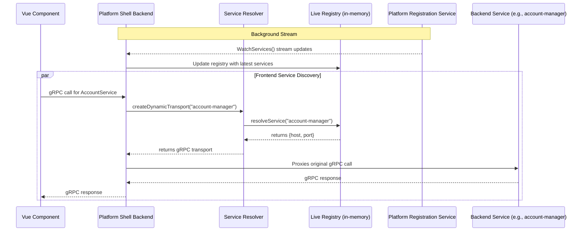
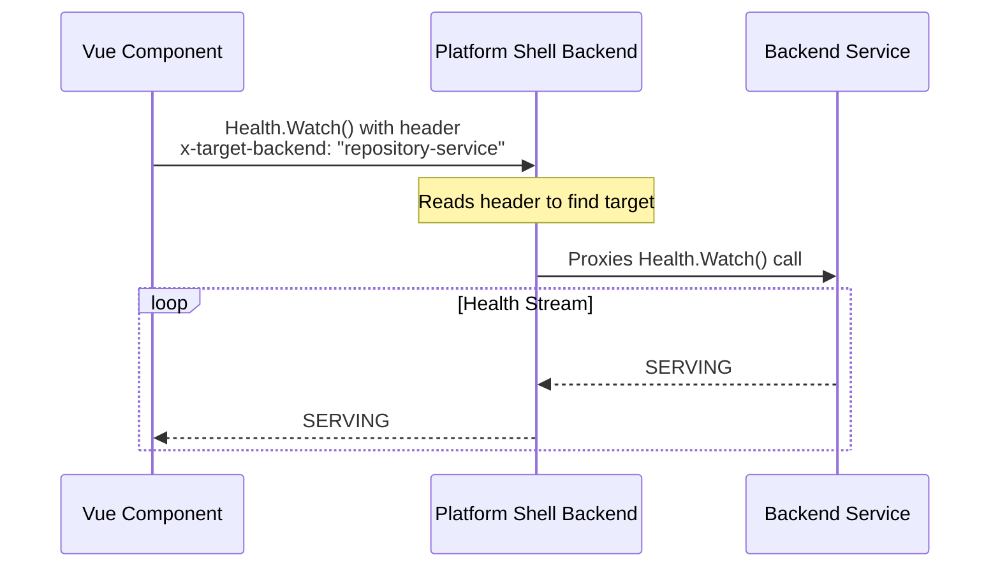
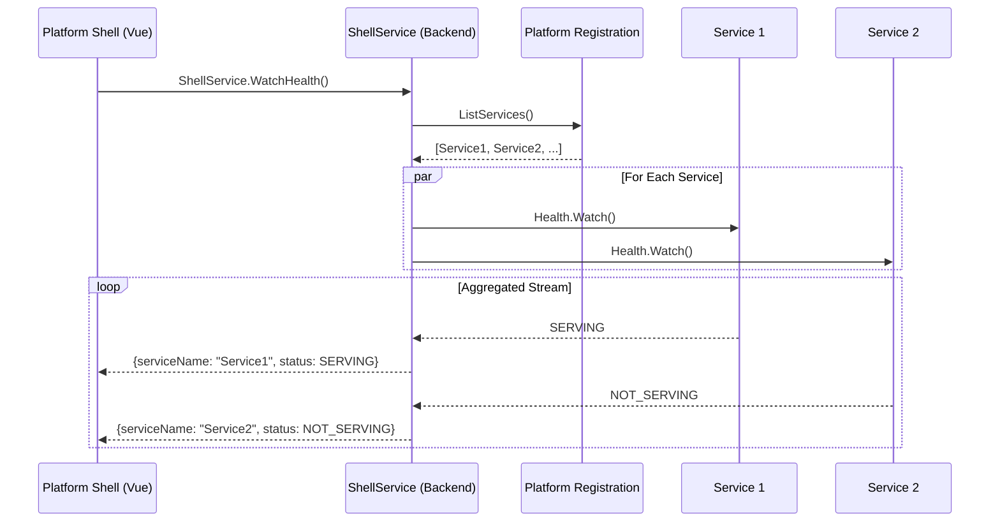

# Frontend Service Discovery and Health

This document explains the mechanisms by which frontend applications discover the network locations of backend services and monitor their health status.

## 1. Service Discovery

The core principle of the architecture is that frontend applications do not need to know the specific host and port of the backend services they need to communicate with. This is handled automatically by the **platform-shell backend**.

Service discovery is managed through platform-registration-service, which maintains a registry of all available services and modules. The platform-shell backend maintains a persistent streaming connection to the service registry, allowing it to respond to service discovery changes in real-time.

### Architecture Layers

**Backend Layer (platform-shell):**
- Maintains live service registry via `WatchServices` stream
- Resolves service names to host:port at request time
- Creates dynamic gRPC transports to backend services

**Frontend Layer (Vue/Pinia):**
- Uses Pinia store for reactive service/module tracking
- Streams availability updates via `WatchServices` and `WatchModules`
- Filters navigation and UI based on available services

### End-to-End Discovery Flow



### Backend Service Discovery Implementation

**Location:** `apps/platform-shell/src/lib/serviceResolver.ts`

```typescript
import { createClient } from "@connectrpc/connect";
import { createGrpcTransport } from "@connectrpc/connect-node";
import { PlatformRegistration, ServiceDetails } from "@ai-pipestream/grpc-stubs/dist/registration/platform_registration_pb";

// Live registry - populated by streaming updates
const serviceRegistry = new Map<string, ServiceDetails>();

// Persistent transport to platform-registration-service
const REGISTRATION_URL = `http://${process.env.PLATFORM_REGISTRATION_HOST || 'localhost'}:${process.env.PLATFORM_REGISTRATION_PORT || '38101'}`;
const registrationTransport = createGrpcTransport({
  baseUrl: REGISTRATION_URL,
  idleConnectionTimeoutMs: 1000 * 60 * 60
});

const registrationClient = createClient(PlatformRegistration, registrationTransport);

/**
 * Watches platform-registration-service for real-time updates.
 * Runs continuously in the background.
 */
async function watchAndCacheServices() {
  try {
    const stream = registrationClient.watchServices({});
    for await (const response of stream) {
      const newRegistry = new Map<string, ServiceDetails>();
      for (const service of response.services) {
        newRegistry.set(service.serviceName, service);
      }
      // Atomically update registry
      serviceRegistry.clear();
      for (const [key, value] of newRegistry.entries()) {
        serviceRegistry.set(key, value);
      }
    }
  } catch (error) {
    console.error("[ServiceResolver] Watch stream failed:", error);
    setTimeout(watchAndCacheServices, 5000); // Retry on failure
  }
}

/**
 * Synchronous lookup against live registry
 */
export function resolveService(serviceName: string): { host: string; port: number } {
  const serviceDetails = serviceRegistry.get(serviceName);
  if (!serviceDetails) {
    throw new Error(`Service "${serviceName}" not found in live registry.`);
  }

  // Normalize localhost to IPv4
  const host = serviceDetails.host === "localhost" ? "127.0.0.1" : serviceDetails.host;
  return { host, port: serviceDetails.port };
}

/**
 * Creates gRPC transport for a dynamically resolved service
 */
export function createDynamicTransport(serviceName: string) {
  const { host, port } = resolveService(serviceName);
  return createGrpcTransport({
    baseUrl: `http://${host}:${port}`,
    idleConnectionTimeoutMs: 1000 * 60 * 60
  });
}

// Start watching on module load
watchAndCacheServices();
```

### Frontend Service Discovery Implementation

**Location:** `apps/platform-shell/ui/src/stores/serviceRegistry.ts`

The frontend uses a **Pinia store** to maintain reactive service/module availability:

```typescript
import { defineStore } from 'pinia';
import { ref } from 'vue';
import { createClient } from '@connectrpc/connect';
import { createConnectTransport } from '@connectrpc/connect-web';
import { PlatformRegistration } from '@ai-pipestream/grpc-stubs/dist/registration/platform_registration_pb';

export const useServiceRegistryStore = defineStore('serviceRegistry', () => {
  const availableServices = ref<Set<string>>(new Set());
  const availableModules = ref<Set<string>>(new Set());

  // Stream services
  const startServiceStream = async () => {
    const transport = createConnectTransport({
      baseUrl: window.location.origin,
      useBinaryFormat: true
    });

    const client = createClient(PlatformRegistration, transport);

    try {
      for await (const response of client.watchServices({})) {
        const services = new Set<string>();
        for (const details of response.services) {
          if (details.isHealthy) {
            services.add(details.serviceName);
          }
        }
        availableServices.value = services; // Triggers Vue reactivity
      }
    } catch (error) {
      setTimeout(startServiceStream, 5000); // Retry with backoff
    }
  };

  // Auto-start on store creation
  startServiceStream();

  return { availableServices, availableModules };
});
```

### Discovery Process Summary

When a Vue component needs to call a backend service:

1. **Client Call:** Component makes a call using Connect-RPC client
2. **Proxy Route:** Request sent to platform-shell backend (`window.location.origin`)
3. **Route Handler:** Platform-shell matches call to service route in `connectRoutes.ts`
4. **Transport Creation:** Handler calls `createDynamicTransport("service-name")`
5. **Live Registry Lookup:** `resolveService()` performs synchronous lookup in in-memory map
6. **Registry Maintenance:** Map continuously updated by background `WatchServices` stream
7. **gRPC Connection:** Platform-shell creates native gRPC transport and forwards request to backend
8. **Response:** Backend response proxied back to frontend

**Transparent to frontend developers** - they only need to know the service name (e.g., "account-manager").

## 2. Health Checking

The platform supports two methods for monitoring the health of backend services from the frontend.

### Method 1: Direct Health Checks (Component-Level)

Individual components can monitor the health of a specific backend service using the standard gRPC Health Checking Protocol.



**Implementation:**

The frontend uses the `GrpcHealthStatus` component from `@ai-pipestream/shared-components`:

```vue
<template>
  <GrpcHealthStatus
    service-name="account-manager"
    target="account-manager"
    :auto-reconnect="true"
    compact
  />
</template>

<script setup lang="ts">
import { GrpcHealthStatus } from '@ai-pipestream/shared-components';
</script>
```

**How it works:**

```typescript
// Simplified from GrpcHealthStatus.vue
import { createClient } from '@connectrpc/connect';
import { createConnectTransport } from '@connectrpc/connect-web';
import { Health } from '@ai-pipestream/grpc-stubs/dist/grpc/health/v1/health_pb';

const transport = createConnectTransport({
  baseUrl: window.location.origin,
  useBinaryFormat: true,
  headers: {
    'x-target-backend': props.target  // Routes to specific service
  }
});

const client = createClient(Health, transport);

// Stream health updates
for await (const response of client.watch({})) {
  currentStatus.value = response.status; // SERVING, NOT_SERVING, UNKNOWN
}
```

**Use Cases:**
- Service-specific status indicators
- Component-level health monitoring
- Tight coupling to a single backend service

**Features:**
- Auto-reconnect with exponential backoff
- Compact and full display modes
- Icon-only mode
- Tooltip with detailed status
- Error display

### Method 2: Aggregated Health Stream (Platform-Level)

For a high-level overview of the entire platform's status, the platform-shell backend provides a custom, aggregated health stream.



**Implementation:**

The frontend uses the `useShellHealth` composable:

```typescript
// apps/platform-shell/ui/src/composables/useShellHealth.ts
import { ref } from 'vue';
import { createClient } from '@connectrpc/connect';
import { createConnectTransport } from '@connectrpc/connect-web';
import { ShellService } from '@ai-pipestream/grpc-stubs/dist/frontend/shell_service_pb';

export function useShellHealth() {
  const updates = ref<Map<string, ServiceHealthUpdate>>(new Map());
  const isConnected = ref(false);
  const error = ref<string | null>(null);

  const transport = createConnectTransport({
    baseUrl: window.location.origin,
    useBinaryFormat: true
  });

  const client = createClient(ShellService, transport);

  const startHealthStream = async () => {
    try {
      isConnected.value = true;

      for await (const update of client.watchHealth({})) {
        // Update the map with latest status for this service
        updates.value.set(update.serviceName, update);
      }
    } catch (e) {
      error.value = `Stream error: ${e.message}`;

      // Try fallback REST endpoint
      await fetchFallbackSnapshot();

      // Schedule reconnect with exponential backoff
      scheduleReconnect();
    } finally {
      isConnected.value = false;
    }
  };

  // Fallback to REST endpoint if streaming fails
  const fetchFallbackSnapshot = async () => {
    const response = await fetch('/connect/system/health-snapshot');
    const snapshot = await response.json();
    // Convert to Map<string, ServiceHealthUpdate>
    updates.value = convertSnapshot(snapshot);
  };

  // Start streaming on composable creation
  startHealthStream();

  return { updates, isConnected, error };
}
```

**Usage in Components:**

```vue
<template>
  <v-card>
    <v-card-title>System Health</v-card-title>
    <v-card-text>
      <div v-for="[name, update] in updates" :key="name">
        <v-chip :color="getStatusColor(update.status)">
          {{ name }}: {{ getStatusText(update.status) }}
        </v-chip>
      </div>
    </v-card-text>
  </v-card>
</template>

<script setup lang="ts">
import { useShellHealth } from '@/composables/useShellHealth';

const { updates, isConnected, error } = useShellHealth();
</script>
```

**Backend Implementation:**

The `ShellService` in platform-shell backend (`src/routes/connectRoutes.ts`) aggregates health from all services:

1. Fetches all registered services from platform-registration
2. Filters for resolvable gRPC services
3. Creates concurrent health watchers for each service
4. Uses async queue to multiplex updates from multiple streams
5. Yields aggregated updates to frontend

**Use Cases:**
- Platform-wide health dashboard
- System status overview
- Multi-service monitoring in single component

**Features:**
- Multiplexed streaming from multiple services
- Fallback to REST endpoint (`/connect/system/health-snapshot`)
- Auto-reconnect with exponential backoff
- Graceful degradation

## 3. Frontend Service Discovery Patterns

### Pattern 1: Navigation Menu (Pinia Store)

**Location:** `apps/platform-shell/ui/src/stores/serviceRegistry.ts`

The main navigation uses a Pinia store that streams service/module availability:

```typescript
export const useServiceRegistryStore = defineStore('serviceRegistry', () => {
  const availableServices = ref<Set<string>>(new Set());
  const availableModules = ref<Set<string>>(new Set());

  // Stream services continuously
  const startServiceStream = async () => {
    const transport = createConnectTransport({
      baseUrl: window.location.origin,
      useBinaryFormat: true
    });
    const client = createClient(PlatformRegistration, transport);

    for await (const response of client.watchServices({})) {
      const services = new Set<string>();
      for (const details of response.services) {
        if (details.isHealthy) {
          services.add(details.serviceName);
        }
      }
      availableServices.value = services;
    }
  };

  startServiceStream();

  return { availableServices, availableModules };
});
```

**Usage in App.vue:**

```typescript
const serviceRegistry = useServiceRegistryStore();

// Filter navigation based on availability
const navItems = computed(() => {
  const items = [...platformItems];

  const availableServiceItems = serviceConfig
    .filter(s => serviceRegistry.availableServices.has(s.service))
    .map(s => ({ title: s.title, icon: s.icon, to: s.path }));

  if (availableServiceItems.length > 0) {
    items.push({
      title: 'Services',
      icon: 'mdi-cube-outline',
      children: availableServiceItems
    });
  }

  return items;
});
```

### Pattern 2: Component-Level Discovery

Individual components can check if a specific service is available:

```vue
<script setup lang="ts">
import { computed } from 'vue';
import { useServiceRegistryStore } from '@/stores/serviceRegistry';

const serviceRegistry = useServiceRegistryStore();
const isAccountServiceAvailable = computed(() =>
  serviceRegistry.availableServices.has('account-manager')
);
</script>

<template>
  <v-alert v-if="!isAccountServiceAvailable" type="warning">
    Account service is not available
  </v-alert>
  <AccountList v-else />
</template>
```

## 4. Health Check Methods Comparison

| Aspect | Method 1: Direct Health Checks | Method 2: Aggregated Stream |
|--------|-------------------------------|----------------------------|
| **Scope** | Single service | All services |
| **Component** | GrpcHealthStatus | useShellHealth composable |
| **Transport** | Uses x-target-backend header | ShellService (custom) |
| **Use Case** | Service-specific indicators | Platform dashboard |
| **Granularity** | Per-component | Platform-wide |
| **Connections** | One per component | One for all services |
| **Fallback** | Component-level retry | REST endpoint fallback |

## 5. Backend Service Discovery (for Reference)

When the platform-shell backend needs to call another service:

```typescript
// From connectRoutes.ts
router.service(AccountService, {
  createAccount(req, context) {
    // Step 1: Resolve service from live registry
    const transport = createDynamicTransport("account-manager");

    // Step 2: Create client with resolved transport
    const client = createClient(AccountService, transport);

    // Step 3: Proxy the call
    return client.createAccount(req);
  }
});
```

The `createDynamicTransport()` function:
1. Looks up "account-manager" in the live service registry
2. Gets host and port
3. Creates a gRPC transport to that endpoint
4. Returns the transport for immediate use

**All synchronous** - no async resolution needed because the registry is pre-populated.

## 6. Service Registration Requirements

For a service to be discoverable:

### Backend Service Must:

1. **Implement gRPC Health service** (`grpc.health.v1.Health`)
2. **Register with platform-registration-service** on startup
3. **Report healthy status** in health checks
4. **Maintain registration** (heartbeat or persistent connection)

### Frontend Configuration:

For services to appear in navigation:

1. **Add to `serviceConfig` array** in `App.vue`
2. **Add route** in `router/index.ts`
3. **Create UI components** in `services/{name}/`

**Service names must match** between registration and frontend configuration.

## 7. Key Design Benefits

### Real-Time Discovery

- ✅ **No polling**: Streaming updates are instant
- ✅ **No caching issues**: Always current state
- ✅ **Sub-second updates**: Services appear/disappear immediately
- ✅ **Efficient**: Single persistent connection

### Transparent to Developers

- ✅ Frontend: Just use service name ("account-manager")
- ✅ Backend: Just use `createDynamicTransport(serviceName)`
- ✅ No hardcoded URLs or ports
- ✅ Services can restart/relocate without code changes

### Fault Tolerance

- ✅ Auto-retry on stream failure (5s backoff)
- ✅ Fallback to REST endpoints (health snapshot)
- ✅ Graceful degradation
- ✅ Manual cache invalidation available

## 8. Troubleshooting

### Service Not Appearing in Navigation

**Check:**
1. Service registered with platform-registration-service?
2. Service reporting healthy status?
3. Service name in frontend `serviceConfig` matches registration?
4. Route added to `router/index.ts`?
5. Check browser console for stream errors

**Debug:**
```bash
# Check service registry
curl http://localhost:38106/connect/system-nav/menu-items.json

# Check health snapshot
curl http://localhost:38106/connect/system/health-snapshot

# Clear cache
curl -X POST http://localhost:38106/connect/system/invalidate-cache
```

### Health Stream Not Connecting

**Check:**
1. Platform-registration-service running?
2. Network connectivity to platform-shell backend?
3. Browser console for Connect errors
4. Backend logs for stream errors

**Fallback:**
- `useShellHealth` automatically falls back to REST endpoint
- Check `/connect/system/health-snapshot` endpoint

## 9. Related Components and Files

### Backend
- `apps/platform-shell/src/lib/serviceResolver.ts` - Service discovery logic
- `apps/platform-shell/src/routes/connectRoutes.ts` - Service routing and ShellService
- `apps/platform-shell/src/index.ts` - REST endpoints for health/nav

### Frontend
- `apps/platform-shell/ui/src/stores/serviceRegistry.ts` - Pinia store for availability
- `apps/platform-shell/ui/src/composables/useShellHealth.ts` - Aggregated health composable
- `packages/shared-components/src/components/GrpcHealthStatus.vue` - Health indicator component

## 10. Related Documentation

- **Platform_Shell-UPDATED.md** - Frontend UI and navigation architecture
- **Platform_Shell_Backend.md** - Backend proxy and routing details
- **GRPC_Client_Examples.md** - How to make gRPC calls
